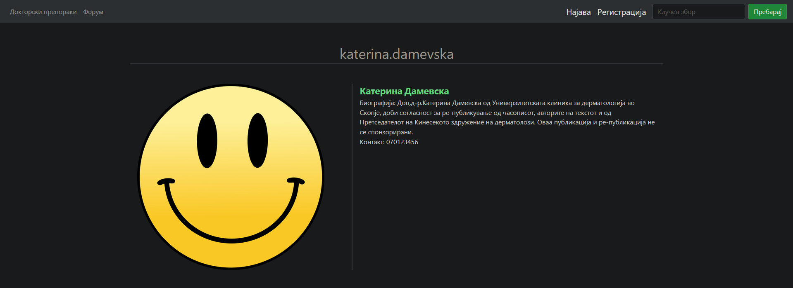

    
    
# CovidLess

## Table of Contents

- [Description](#description)
- [Screenshots](#screenshots)
- [Built With](#built-with)
- [Getting Started](#getting-started)
- [Contacts](#contacts)

## Description

This app is running to prevent people getting and spreading Covid-19. The Coronavirus is very contagious virus that attacks mainly lungs and can be transmitted through breathing up close to each other. To prevent this from happening and to get healthy habits on how to live without coronavirus I've created this website.

## Screenshots
Login page.

Doctor's page. You'll find great content here.

Doctor's profile. You'll find informations and contact about specified doctor.

Forum. If you have an account you can post here.

## Built With

## Getting Started

Go to https://covidless.herokuapp.com/ website and start experiencing the newest anti coronavirus app.

## Contacts
Bojan Dukovski,  
Bitola, Republic of Macedonia,  
075546989  
  
